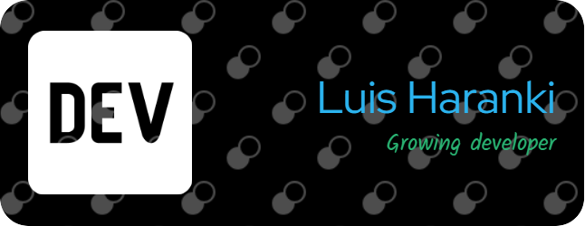

# <iframe src="https://giphy.com/embed/bcKmIWkUMCjVm" width="250" height="120" frameBorder="0" class="giphy-embed" allowFullScreen></iframe> Bienvenid@s al GitHub de Luis Haranki 

### Contáctame en:

--
Ingeniero electricista con una pasión autodidacta por la progrmación :smile::zap:. Siempre buscando aprender y crecer en el fascinante mundo del desarrollo de software :computer:. Comprometido con el aprendizaje continuo y entusiasmado por enfrentar nuevos desafíos en el campo de la programación:pencil2::blue_book::muscle:.

## Tecnologias :computer:

--

